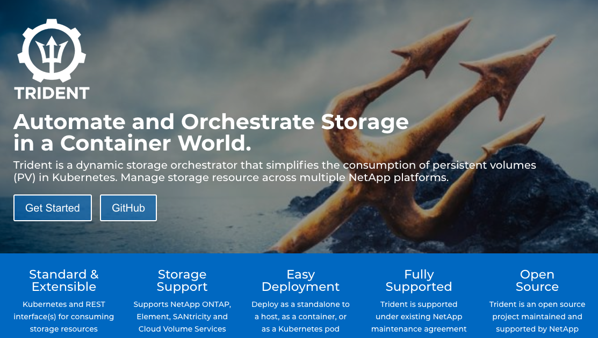
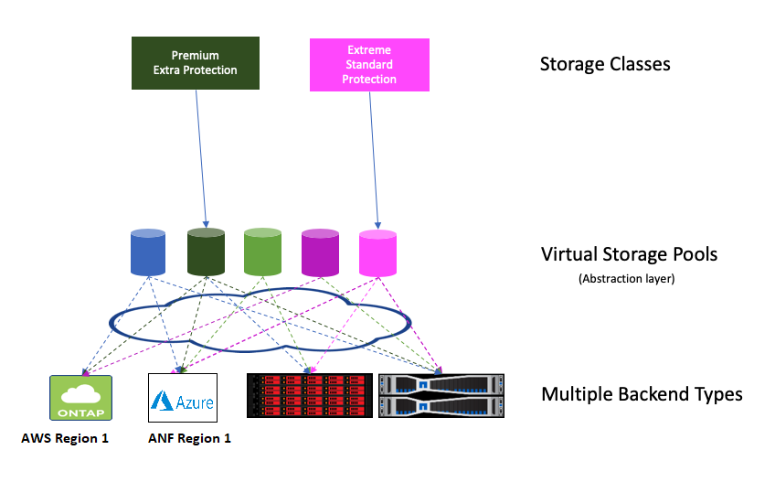
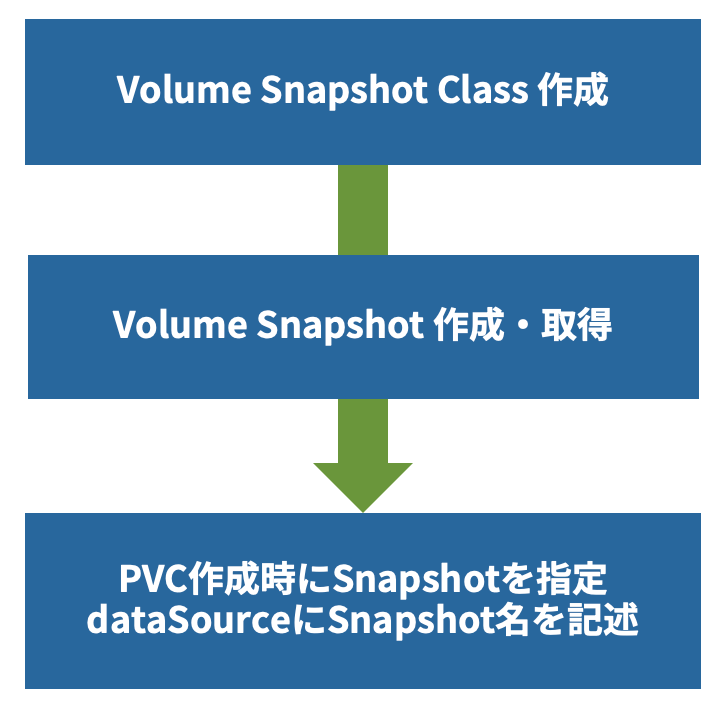

# NetAPp/Trident 19.07 new features

## 目的

Trident 19.07 & CSI 1.1 対応したためCSI対応周りとTrident 19.07 の変更事項(自分が興味あるところについて)について試してみました。

[Trident 19.07 is now GA - thePub](https://netapp.io/2019/07/31/trident-19-07ga/)

## 注意

本記事で言及するCSI 1.1 のSnapshotやCloneは現時点でアルファステータスなため、どのような機能かを試すぐらいの目的でご使用ください。

本番環境での利用は強くおすすめしません。

## Tridentとは

お約束。

要するにNetAppストレージとKubernetesをつなぐプラグイン。Kubernetesに Dynamic Storage Provisioning の仕組みがない頃から開発していて、CSIにも対応。

NetAppのストレージ・ポートフォリオを使用する場合、このダイナミックプロビジョニング機能は、NetAppのオープンソースプロジェクトのNetApp Tridentを使用して提供されます。
TridentはKubernetes/OpenShiftに対応する External Storage Provisioner です。NFSエクスポートや iSCSI LUN などのストレージリソースを動的に作成し、アプリケーションによって指定された StorgeClass に設定されている要求を満たしたストレージリソースを作成し、提供します。 アプリケーションは、基盤となるストレージインフラストラクチャを気にすることなく、Kubernetesクラスタ内のホスト間で Pod をシームレスに拡張し、展開でき、 必要なときに、必要な場所でストレージリソースを利用できます。
Trident は Storage Dynamic Provisioner として NetApp ストレージと StorageClass をマッピングすることで個々のアプリケーションに最適なストレージを提供することができます。



## New features & enhancements

Trident 19.07 での変更事項として以下のものが挙げられます。

### CSI モードでのデプロイが標準に。(Kubernets 1.14以降)

CSIの機能も利用可能になりました。SnapShot, Clone, Resize などなどが Kubernetesからシームレスに操作できるようになりました。
CSI 1.1に対応したTridentバージョンとなります。

### CRDの導入

19.07以前では接続情報などはTrident同梱のetcdに保管されていたが、本バージョンからはCRDをつかうことでKubernetes本体のetcdに保管されるようになりました。
またパスワード等もSecret等を使いよりKubernetesの枠組みのなかで使用できるようになりました。

### Azure NetApp Files 対応

Azure NetApp Files (ANF) にも対応しました。 AKS や Azure上のIaaS上のKubernetesからもTridentを使えるように。

ANFについてはこちら： ベアメタルクラウドファイルストレージ/データ管理サービス。

  [Azure NetApp Files が一般公開されました | ブログ | Microsoft Azure](https://azure.microsoft.com/ja-jp/blog/azure-netapp-files-is-now-generally-available/)

### Virtual Storage Poolの強化

`StorageClass` とバックエンドのストレージ本体間の抽象化レイヤとして `Virtual Storage Pools`　を導入しました。
Element, SANTricity, CVS for AWS, ANF で追加されるようになりました。
バックエンドストレージを意識することなく、`StorageClass` で設定した条件（パフォーマンス、データ保護、ロケーショなど）を元にPVをプロビジョニングします。



## インストール

今まで通りGitHubからバイナリをダウンロードします。
バックエンドはNFSを使いCSIの機能であるSnapshot, Cloneを試します。

### Trident 19.07 のインストール

``` bash
$ wget https://github.com/NetApp/trident/releases/download/v19.07.0/trident-installer-19.07.0.tar.gz
$ tar -xf trident-installer-19.07.0.tar.gz
$ cd trident-installer
$ ./tridentctl install -n trident
```

Kubernetes は `1.14` を使ったので特にfeature gateを設定せずとも動作しました。1.13より以前の場合は feature gate を有効化する必要があります。

- [Kubernetes 1.13 以前へTridentインストール時の設定](https://netapp-trident.readthedocs.io/en/stable-v19.07/kubernetes/deploying.html#installing-trident-on-kubernetes-1-13)

Trident 19.04 が導入されている環境で実施しましたが自動でCSIへのマイグレーションも実行されました。

インストール後にTridentがインストールされる `trident` namespace を確認します。

```bash
$ kubectl get all -n trident

NAME                               READY   STATUS    RESTARTS   AGE
pod/trident-csi-6r88q              2/2     Running   0          7d16h
pod/trident-csi-867d54588b-vz8ss   4/4     Running   0          7d16h
pod/trident-csi-c66qw              2/2     Running   0          7d16h
pod/trident-csi-qkptw              2/2     Running   0          7d16h

NAME                  TYPE        CLUSTER-IP      EXTERNAL-IP   PORT(S)     AGE
service/trident-csi   ClusterIP   10.104.55.199   <none>        34571/TCP   7d16h

NAME                         DESIRED   CURRENT   READY   UP-TO-DATE   AVAILABLE   NODE SELECTOR   AGE
daemonset.apps/trident-csi   3         3         3       3            3           <none>          7d16h

NAME                          READY   UP-TO-DATE   AVAILABLE   AGE
deployment.apps/trident-csi   1/1     1            1           7d16h

NAME                                     DESIRED   CURRENT   READY   AGE
replicaset.apps/trident-csi-867d54588b   1         1         1       7d16h
```

Trident 19.07 から導入されたCRDを確認します。

```bash
$ kubectl get crd

# trident 部分だけを抜粋
NAME                                             CREATED AT
tridentbackends.trident.netapp.io                2019-08-01T15:09:37Z
tridentnodes.trident.netapp.io                   2019-08-01T15:09:37Z
tridentsnapshots.trident.netapp.io               2019-08-01T15:09:37Z
tridentstorageclasses.trident.netapp.io          2019-08-01T15:09:37Z
tridenttransactions.trident.netapp.io            2019-08-01T15:09:37Z
tridentversions.trident.netapp.io                2019-08-01T15:09:37Z
tridentvolumes.trident.netapp.io                 2019-08-01T15:09:37Z
volumesnapshotclasses.snapshot.storage.k8s.io    2019-08-01T15:10:03Z
volumesnapshotcontents.snapshot.storage.k8s.io   2019-08-01T15:10:03Z
volumesnapshots.snapshot.storage.k8s.io          2019-08-01T15:10:03Z
```

### バックエンドストレージの登録

`setup/backend.json` に接続情報を記述し、以下のtridentctlでバックエンドを登録します。

``` bash
$ ./tridentctl create backend -f setup/backend.json  -n trident
+-------------------+----------------+--------------------------------------+--------+---------+
|       NAME        | STORAGE DRIVER |                 UUID                 | STATE  | VOLUMES |
+-------------------+----------------+--------------------------------------+--------+---------+
|  BackendName      | ontap-nas      | e705fc2e-2aad-476b-89e0-d51721c98019 | online |       0 |
+-------------------+----------------+--------------------------------------+--------+---------+
```

ここまでで CSI Trident の導入が完了です。

## 事前準備(StorageClass, PVCの作成)

ここからは `Snapshot` と `Clone` を実行するために `StorageClass` 、元となる `PVC` を作成します。

StorageClassの作成時のパラメータの指定を変更するだけでCSI対応となります。

### StorageClassの作成

CSI版のStorageClassを作成します。
今までとあまり変更はありませんが、provisioner の指定部分がCSI対応のものになります。 `provisioner: csi.trident.netapp.io` とします。

https://gist.github.com/makotow/7fa2dc3e984a2f8d4b286aba66de8ffd

```bash
$ kubectl create -f storageclass-csi.yaml
$ kubectl get sc
NAME                   PROVISIONER             AGE
basic-csi              csi.trident.netapp.io   11d
ontap-gold (default)   csi.trident.netapp.io   11d
```

ちなみに `ontap-gold` は19.04で作成した`StorageClass`です。
CSI Tridentを導入したことで `PROVISIONNER` が `csi.trident.netapp.io` へ移行されています。

### PVCの作成

上記で作成した`StorageClass`の`basic-csi`を使用し、PVCを作成します。

https://gist.github.com/makotow/cff97f12a9e71520aae20bd3a0be44e7

`storageClassName: basic-csi`とします。

```bash
$ kubectl create -f pvc-sample.yaml
persistentvolumeclaim/basic created

$ kubectl get pvc
NAME    STATUS   VOLUME                                     CAPACITY   ACCESS MODES   STORAGECLASS   AGE
basic   Bound    pvc-7547fa11-bd9f-11e9-a9c7-005056ab3e0c   1Gi        RWO            basic-csi      5s
```

basicという名前でPVCが作成されました。
これ以降はこの `basic` PVCに対して操作していきます。

## CSI の SnapShot と Clone を試す

SnapshotとCloneは実現することはほとんど同じです。
最終的にはPVCとしてアプリケーションから使用します。

以下のような使い分けになります。

- Volume Snapshot: EBS等のスナップショットと同じイメージ、一旦データを保管し、テスト実行後に最初の状態に戻す
- Volume Clone: 元データをコピーしてテスト環境を作る

### Volume Snapshot

Volume Snapshotを実現するためには幾つかのオブジェクトを準備する必要があります。



#### VolumeSnapshotClassの作成

VolumeSnapshotClassを作成します。

必要最小限で作成しています。

snapsotterは以下の通り設定します。

このオブジェクトの役目はsnapshotが発行されたときに使用するSnapshotterを指定することです。

- `snapshotter: csi.trident.netapp.io`

https://gist.github.com/makotow/65d112ae639f7e83f2a9717574cd7bee

```bash
$ kubectl create -f VolumeSnapShotClass.yaml
volumesnapshotclass.snapshot.storage.k8s.io/csi-vsc created

$ kubectl get volumesnapshotclass
NAME      AGE
csi-vsc   33s
```

`csi-vsc` という VolumeSnapshotClassが作成されました。

VolumeSnapShotを作成する際にはこのクラス名を使用します。

#### VolumeSnapshot の作成・取得

ここからが実際にスナップショットを取得するマニフェストになります。

https://gist.github.com/makotow/9b3c4412fd4a3b6eca82db42a2fe4168

```bash
$ kubectl create -f VolumeSnapshot.yaml
volumesnapshot.snapshot.storage.k8s.io/basic-snapshot created

$ kubectl get volumesnapshot
NAME             AGE
basic-snapshot   6s
```

#### PVC作成

ここでは取得したSnapshotからPVCのを作成します。

マニフェストは以下の通り。

https://gist.github.com/makotow/e5aad2957587848f6e0cdd2e9565abab

ポイントは以下の `dataSource` になります、dataSourceで復元するSnapshotを定義します。
このあとにでてくる Clone についても同様の方法です。

``` yaml
  dataSource:
    name: basic-snapshot
    kind: VolumeSnapshot
    apiGroup: snapshot.storage.k8s.io
```

実行します。

```bash
$ kubectl create -f pvc-from-snap.yaml
persistentvolumeclaim/pvc-from-snap created

$ kubectl get pvc
NAME            STATUS   VOLUME                                     CAPACITY   ACCESS MODES   STORAGECLASS   AGE
basic           Bound    pvc-7547fa11-bd9f-11e9-a9c7-005056ab3e0c   1Gi        RWO            basic-csi      55m
pvc-from-snap   Bound    pvc-11aa755c-bda7-11e9-a9c7-005056ab3e0c   1Gi        RWO            basic-csi      37s
```

SnapshotからPVCを作成することができました。

### Volume Clone

`Volume Clone` を実施します。

こちらは非常に簡単に利用できます。
Cloneを作成する際に対象となるPVCのを指定すると新たなPVCが作成されます。

https://gist.github.com/makotow/5e6435c34148a91558f38304bf5a70a6

```bash
$ kubectl create -f pvc-clone-from-pvc.yaml
persistentvolumeclaim/pvc-from-pvc created

$ kubectl get pvc
NAME            STATUS   VOLUME                                     CAPACITY   ACCESS MODES   STORAGECLASS   AGE
basic           Bound    pvc-7547fa11-bd9f-11e9-a9c7-005056ab3e0c   1Gi        RWO            basic-csi      73m
pvc-from-pvc    Bound    pvc-a4d42841-bda9-11e9-a9c7-005056ab3e0c   1Gi        RWO            basic-csi      7s
pvc-from-snap   Bound    pvc-11aa755c-bda7-11e9-a9c7-005056ab3e0c   1Gi        RWO            basic-csi      18m
```

`pvc-from-pvc`　というPVCが作成されました。

ここまでで一通り `Volume Snapshot` と `Volume Clone` を実施してみました。

## まとめ

ストレージ側で実施していたことやストレージベンダー独自の管理ツール等で行っていことがCSIが策定されたことによりストレージを意識せずに、Kubernetesから行えるようになりました。さらにSnapshotやCloning、Resizeも可能となりデータ管理系も充実してきており、これからの発展が楽しみな領域となってきています。


localadmin@master:~/trident-installer$ kubectl get pv
NAME                                       CAPACITY      ACCESS MODES   RECLAIM POLICY   STATUS   CLAIM                     STORAGECLASS   REASON   AGE
pvc-23c25046-b510-11e9-a9c7-005056ab3e0c   1Gi           RWO            Delete           Bound    default/basic             basic-csi               3m51s

localadmin@master:~/trident-installer$ kubectl get pvc
NAME    STATUS   VOLUME                                     CAPACITY   ACCESS MODES   STORAGECLASS   AGE
basic   Bound    pvc-23c25046-b510-11e9-a9c7-005056ab3e0c   1Gi        RWO            basic-csi      12m

```
localadmin@master:~/trident-installer$ kubectl get crd tridentstorageclasses.trident.netapp.io -o json
{
    "apiVersion": "apiextensions.k8s.io/v1beta1",
    "kind": "CustomResourceDefinition",
    "metadata": {
        "creationTimestamp": "2019-08-01T15:09:37Z",
        "finalizers": [
            "trident.netapp.io"
        ],
        "generation": 1,
        "name": "tridentstorageclasses.trident.netapp.io",
        "resourceVersion": "3665201",
        "selfLink": "/apis/apiextensions.k8s.io/v1beta1/customresourcedefinitions/tridentstorageclasses.trident.netapp.io",
        "uid": "60f41bf6-b46e-11e9-a9c7-005056ab3e0c"
    },
    "spec": {
        "conversion": {
            "strategy": "None"
        },
        "group": "trident.netapp.io",
        "names": {
            "categories": [
                "trident",
                "trident-internal"
            ],
            "kind": "TridentStorageClass",
            "listKind": "TridentStorageClassList",
            "plural": "tridentstorageclasses",
            "shortNames": [
                "tsc",
                "tstorageclass"
            ],
            "singular": "tridentstorageclass"
        },
        "scope": "Namespaced",
        "version": "v1",
        "versions": [
            {
                "name": "v1",
                "served": true,
                "storage": true
            }
        ]
    },
    "status": {
        "acceptedNames": {
            "categories": [
                "trident",
                "trident-internal"
            ],
            "kind": "TridentStorageClass",
            "listKind": "TridentStorageClassList",
            "plural": "tridentstorageclasses",
            "shortNames": [
                "tsc",
                "tstorageclass"
            ],
            "singular": "tridentstorageclass"
        },
        "conditions": [
            {
                "lastTransitionTime": "2019-08-01T15:09:37Z",
                "message": "no conflicts found",
                "reason": "NoConflicts",
                "status": "True",
                "type": "NamesAccepted"
            },
            {
                "lastTransitionTime": null,
                "message": "the initial names have been accepted",
                "reason": "InitialNamesAccepted",
                "status": "True",
                "type": "Established"
            }
        ],
        "storedVersions": [
            "v1"
        ]
    }
}

localadmin@master:~/trident-installer$ ls
extras  pvc-sample.yaml  sample-input  setup  storage-class-csi.yaml  tridentctl
localadmin@master:~/trident-installer$ kubectl get crd -o json tridentversions.trident.netapp.io
{
    "apiVersion": "apiextensions.k8s.io/v1beta1",
    "kind": "CustomResourceDefinition",
    "metadata": {
        "creationTimestamp": "2019-08-01T15:09:37Z",
        "finalizers": [
            "trident.netapp.io"
        ],
        "generation": 1,
        "name": "tridentversions.trident.netapp.io",
        "resourceVersion": "3665203",
        "selfLink": "/apis/apiextensions.k8s.io/v1beta1/customresourcedefinitions/tridentversions.trident.netapp.io",
        "uid": "60ee8b6e-b46e-11e9-a9c7-005056ab3e0c"
    },
    "spec": {
        "additionalPrinterColumns": [
            {
                "JSONPath": ".trident_version",
                "description": "The Trident version",
                "name": "Version",
                "type": "string"
            }
        ],
        "conversion": {
            "strategy": "None"
        },
        "group": "trident.netapp.io",
        "names": {
            "categories": [
                "trident",
                "trident-internal"
            ],
            "kind": "TridentVersion",
            "listKind": "TridentVersionList",
            "plural": "tridentversions",
            "shortNames": [
                "tver",
                "tversion"
            ],
            "singular": "tridentversion"
        },
        "scope": "Namespaced",
        "version": "v1",
        "versions": [
            {
                "name": "v1",
                "served": true,
                "storage": true
            }
        ]
    },
    "status": {
        "acceptedNames": {
            "categories": [
                "trident",
                "trident-internal"
            ],
            "kind": "TridentVersion",
            "listKind": "TridentVersionList",
            "plural": "tridentversions",
            "shortNames": [
                "tver",
                "tversion"
            ],
            "singular": "tridentversion"
        },
        "conditions": [
            {
                "lastTransitionTime": "2019-08-01T15:09:37Z",
                "message": "no conflicts found",
                "reason": "NoConflicts",
                "status": "True",
                "type": "NamesAccepted"
            },
            {
                "lastTransitionTime": null,
                "message": "the initial names have been accepted",
                "reason": "InitialNamesAccepted",
                "status": "True",
                "type": "Established"
            }
        ],
        "storedVersions": [
            "v1"
        ]
    }
}
localadmin@master:~/trident-installer$ kubectl describe tridentbackends -n trident
Name:          tbe-mtbj9
Namespace:     trident
Labels:        <none>
Annotations:   <none>
API Version:   trident.netapp.io/v1
Backend Name:  user10BackendName
Backend UUID:  e705fc2e-2aad-476b-89e0-d51721c98019
Config:
  Ontap Config:
    Aggregate:
    Backend Name:       user10BackendName
    Data LIF:           192.168.10.200
    Debug:              false
    Debug Trace Flags:  <nil>
    Defaults:
      Encryption:                 false
      Export Policy:              default
      File System Type:           ext4
      Security Style:             unix
      Size:                       1G
      Snapshot Dir:               false
      Snapshot Policy:            none
      Snapshot Reserve:
      Space Allocation:           true
      Space Reserve:              none
      Split On Clone:             false
      Unix Permissions:           ---rwxrwxrwx
    Disable Delete:               false
    Igroup Name:
    Limit Aggregate Usage:
    Limit Volume Size:
    Management LIF:               192.168.10.200
    Nfs Mount Options:
    Password:                     secret:tbe-e705fc2e-2aad-476b-89e0-d51721c98019
    Qtree Prune Flexvols Period:
    Qtree Quota Resize Period:
    Serial Numbers:
    Storage Driver Name:  ontap-nas
    Storage Prefix:
    Svm:              svm10
    Usage Heartbeat:
    Username:         secret:tbe-e705fc2e-2aad-476b-89e0-d51721c98019
    Version:          1
Kind:                 TridentBackend
Metadata:
  Creation Timestamp:  2019-08-02T10:35:52Z
  Finalizers:
    trident.netapp.io
  Generate Name:     tbe-
  Generation:        1
  Resource Version:  3822109
  Self Link:         /apis/trident.netapp.io/v1/namespaces/trident/tridentbackends/tbe-mtbj9
  UID:               4cebd78e-b511-11e9-a9c7-005056ab3e0c
Online:              true
State:               online
Version:             1
Events:              <none>
localadmin@master:~/trident-installer$ kubectl get secret
NAME                  TYPE                                  DATA   AGE
default-token-qt4zr   kubernetes.io/service-account-token   3      20d
localadmin@master:~/trident-installer$ kubectl get secret -n trident
NAME                                       TYPE                                  DATA   AGE
default-token-g66jg                        kubernetes.io/service-account-token   3      17d
tbe-e705fc2e-2aad-476b-89e0-d51721c98019   Opaque                                2      10m
trident-csi                                Opaque                                6      19h
trident-csi-token-nkn75                    kubernetes.io/service-account-token   3      19h

localadmin@master:~/csi-features/snapshot$ cat vsm.yaml
apiVersion: snapshot.storage.k8s.io/v1alpha1
kind: VolumeSnapshotClass
metadata:
  name: csi-vsc
snapshotter: xcsi.trident.netapp.io
parameters:

```
localadmin@master:~/csi-features/snapshot$ cat *
apiVersion: v1
kind: PersistentVolumeClaim
metadata:
  name: pvc-from-snap
spec:
  accessModes:
    - ReadWriteOnce
  storageClassName: basic-csi
  resources:
    requests:
      storage: 3Gi
  dataSource:
    name: basic-snapshot
    kind: VolumeSnapshot
    apiGroup: snapshot.storage.k8s.io

apiVersion: snapshot.storage.k8s.io/v1alpha1
kind: VolumeSnapshotClass
metadata:
  name: csi-vsc
snapshotter: csi.trident.netapp.io
parameters:

apiVersion: snapshot.storage.k8s.io/v1alpha1
kind: VolumeSnapshot
metadata:
  name: basic-snapshot
spec:
  snapshotClassName: csi-vsc
  source:
    name: basic
    kind: PersistentVolumeClaim
```

```
localadmin@master:~/csi-features/snapshot$ kubectl get VolumeSnapshotClass
NAME      AGE
csi-vsc   27s

localadmin@master:~/csi-features/snapshot$ kubectl describe VolumeSnapshotClass
Name:         csi-vsc
Namespace:
Labels:       <none>
Annotations:  <none>
API Version:  snapshot.storage.k8s.io/v1alpha1
Kind:         VolumeSnapshotClass
Metadata:
  Creation Timestamp:  2019-08-02T10:54:55Z
  Generation:          1
  Resource Version:    3824677
  Self Link:           /apis/snapshot.storage.k8s.io/v1alpha1/volumesnapshotclasses/csi-vsc
  UID:                 f68a6acc-b513-11e9-a9c7-005056ab3e0c
Parameters:            <nil>
Snapshotter:           csi.trident.netapp.io
Events:                <none>

```

localadmin@master:~/csi-features/snapshot$ kubectl get volumesnapshot
NAME             AGE
basic-snapshot   8s
localadmin@master:~/csi-features/snapshot$


localadmin@master:~/csi-features/snapshot$ kubectl describe volumesnapshot
Name:         basic-snapshot
Namespace:    default
Labels:       <none>
Annotations:  <none>
API Version:  snapshot.storage.k8s.io/v1alpha1
Kind:         VolumeSnapshot
Metadata:
  Creation Timestamp:  2019-08-02T10:56:17Z
  Finalizers:
    snapshot.storage.kubernetes.io/volumesnapshot-protection
  Generation:        3
  Resource Version:  3824871
  Self Link:         /apis/snapshot.storage.k8s.io/v1alpha1/namespaces/default/volumesnapshots/basic-snapshot
  UID:               2750f898-b514-11e9-a9c7-005056ab3e0c
Spec:
  Snapshot Class Name:    csi-vsc
  Snapshot Content Name:  snapcontent-2750f898-b514-11e9-a9c7-005056ab3e0c
  Source:
    API Group:  <nil>
    Kind:       PersistentVolumeClaim
    Name:       basic
Status:
  Creation Time:  2019-08-02T10:56:17Z
  Ready To Use:   true
  Restore Size:   1Gi
Events:           <none>
localadmin@master:~/csi-features/snapshot$ kubectl create -f pvc-snap.yaml
persistentvolumeclaim/pvc-from-snap created


localadmin@master:~/csi-features/snapshot$ kubectl describe pvc pvc-from-snap
Name:          pvc-from-snap
Namespace:     default
StorageClass:  basic-csi
Status:        Bound
Volume:        pvc-51c7a602-b514-11e9-a9c7-005056ab3e0c
Labels:        <none>
Annotations:   pv.kubernetes.io/bind-completed: yes
               pv.kubernetes.io/bound-by-controller: yes
               volume.beta.kubernetes.io/storage-provisioner: csi.trident.netapp.io
Finalizers:    [kubernetes.io/pvc-protection]
Capacity:      3Gi
Access Modes:  RWO
VolumeMode:    Filesystem
Events:
  Type       Reason                Age                From                                                                                     Message
  ----       ------                ----               ----                                                                                     -------
  Normal     ExternalProvisioning  60s (x2 over 60s)  persistentvolume-controller                                                              waiting for a volume to be created, either by external provisioner "csi.trident.netapp.io" or manually created by system administrator
  Normal     Provisioning          60s                csi.trident.netapp.io_trident-csi-867d54588b-vz8ss_691cacef-b46e-11e9-8068-82d48f76d62a  External provisioner is provisioning volume for claim "default/pvc-from-snap"
  Normal     ProvisioningSuccess   58s                csi.trident.netapp.io                                                                    provisioned a volume
Mounted By:  <none>


localadmin@master:~/csi-features/snapshot$ kubectl describe volumesnapshotcontent
Name:         snapcontent-2750f898-b514-11e9-a9c7-005056ab3e0c
Namespace:
Labels:       <none>
Annotations:  <none>
API Version:  snapshot.storage.k8s.io/v1alpha1
Kind:         VolumeSnapshotContent
Metadata:
  Creation Timestamp:  2019-08-02T10:56:18Z
  Finalizers:
    snapshot.storage.kubernetes.io/volumesnapshotcontent-protection
  Generation:        1
  Resource Version:  3824869
  Self Link:         /apis/snapshot.storage.k8s.io/v1alpha1/volumesnapshotcontents/snapcontent-2750f898-b514-11e9-a9c7-005056ab3e0c
  UID:               27ad00cc-b514-11e9-a9c7-005056ab3e0c
Spec:
  Csi Volume Snapshot Source:
    Creation Time:    1564743377000000000
    Driver:           csi.trident.netapp.io
    Restore Size:     1073741824
    Snapshot Handle:  pvc-23c25046-b510-11e9-a9c7-005056ab3e0c/snapshot-2750f898-b514-11e9-a9c7-005056ab3e0c
  Deletion Policy:    Delete
  Persistent Volume Ref:
    API Version:        v1
    Kind:               PersistentVolume
    Name:               pvc-23c25046-b510-11e9-a9c7-005056ab3e0c
    Resource Version:   3822149
    UID:                5473237d-b511-11e9-a9c7-005056ab3e0c
  Snapshot Class Name:  csi-vsc
  Volume Snapshot Ref:
    API Version:       snapshot.storage.k8s.io/v1alpha1
    Kind:              VolumeSnapshot
    Name:              basic-snapshot
    Namespace:         default
    Resource Version:  3824860
    UID:               2750f898-b514-11e9-a9c7-005056ab3e0c
Events:                <none>


apiVersion: v1 
kind: PersistentVolumeClaim 
metadata: 
  name: pvc-from-snap 
spec: 
  accessModes: 
    - ReadWriteOnce 
  storageClassName: golden 
  resources: 
    requests: 
      storage: 3Gi 
  dataSource: 
    name: vol1-snapshot 
    kind: VolumeSnapshot 
    apiGroup: snapshot.storage.k8s.io 

localadmin@master:~/csi-features/clone$ kubectl create -f pvc-clone.yaml
persistentvolumeclaim/pvc-from-snap created
localadmin@master:~/csi-features/clone$ kubectl get pvc
NAME            STATUS   VOLUME                                     CAPACITY   ACCESS MODES   STORAGECLASS   AGE
basic           Bound    pvc-23c25046-b510-11e9-a9c7-005056ab3e0c   1Gi        RWO            basic-csi      42m
pvc-from-snap   Bound    pvc-09a31fc0-b516-11e9-a9c7-005056ab3e0c   3Gi        RWO            basic-csi      3s


localadmin@master:~/csi-features/clone$ kubectl describe pvc pvc-from-snap

Name:          pvc-from-snap
Namespace:     default
StorageClass:  basic-csi
Status:        Bound
Volume:        pvc-09a31fc0-b516-11e9-a9c7-005056ab3e0c
Labels:        <none>
Annotations:   pv.kubernetes.io/bind-completed: yes
               pv.kubernetes.io/bound-by-controller: yes
               volume.beta.kubernetes.io/storage-provisioner: csi.trident.netapp.io
Finalizers:    [kubernetes.io/pvc-protection]
Capacity:      3Gi
Access Modes:  RWO
VolumeMode:    Filesystem
Events:
  Type       Reason                Age                From                                                                                     Message
  ----       ------                ----               ----                                                                                     -------
  Normal     Provisioning          46s                csi.trident.netapp.io_trident-csi-867d54588b-vz8ss_691cacef-b46e-11e9-8068-82d48f76d62a  External provisioner is provisioning volume for claim "default/pvc-from-snap"
  Normal     ExternalProvisioning  45s (x3 over 46s)  persistentvolume-controller                                                              waiting for a volume to be created, either by external provisioner "csi.trident.netapp.io" or manually created by system administrator
  Normal     ProvisioningSuccess   44s                csi.trident.netapp.io                                                                    provisioned a volume
Mounted By:  <none>


localadmin@master:~/csi-features/clone$ cat pvc-clone.yaml
apiVersion: v1
kind: PersistentVolumeClaim
metadata:
  name: pvc-from-snap
spec:
  accessModes:
    - ReadWriteOnce
  storageClassName: basic-csi
  resources:
    requests:
      storage: 3Gi
  dataSource:
    name: basic-snapshot
    kind: PersistentVolumeClaim
    